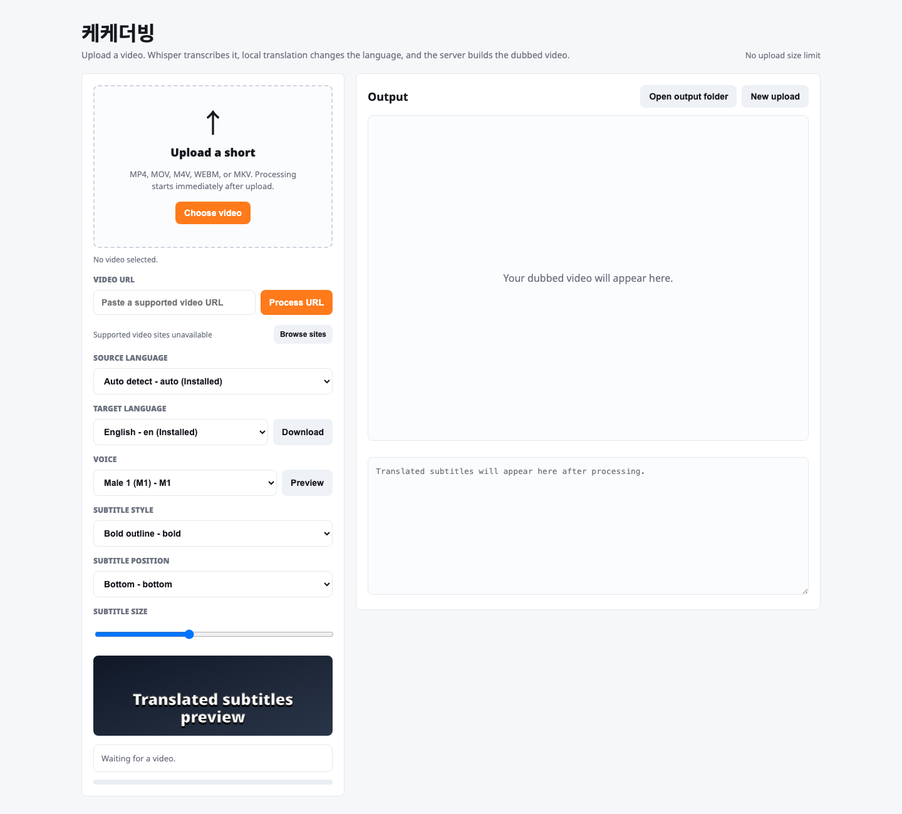
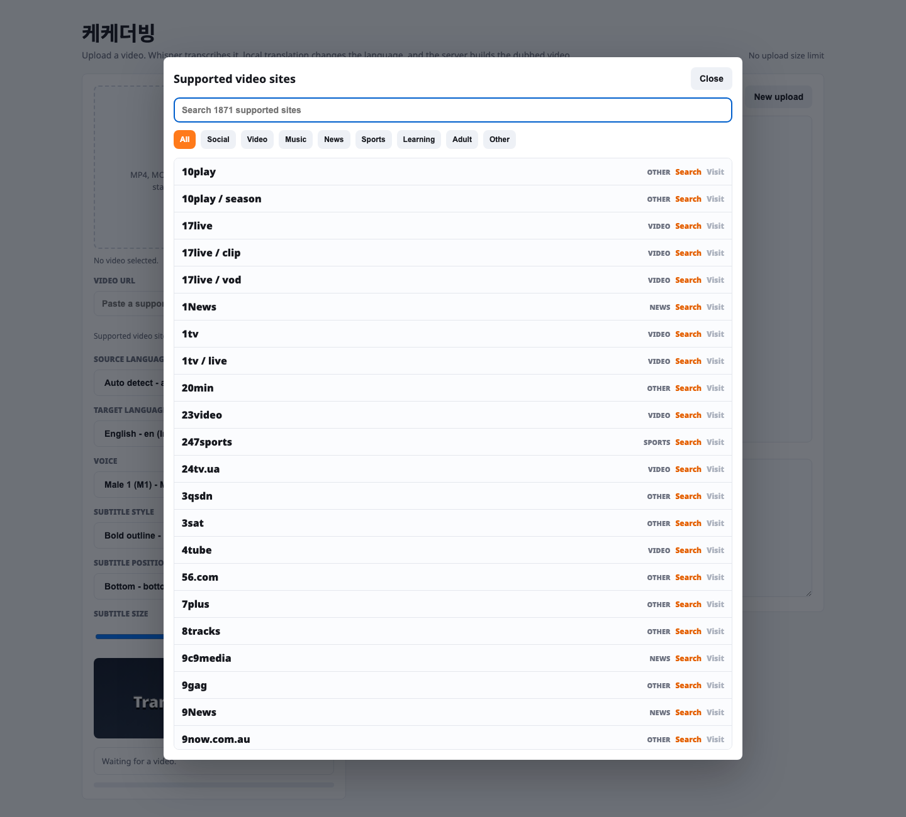

# 케케더빙

**케케더빙** (`kekedubing`) is an open-source local video translation and dubbing tool. It can import a local video file or a supported video URL, preview the source, apply simple rectangular blur edits, translate speech, synthesize a dubbed voice, burn subtitles, and export the final MP4.

The project is designed to avoid external APIs where possible and run with local models on your own machine.

한국어 문서: [README.ko.md](README.ko.md)

## Screenshots





## Features

- Upload a local video file
- Import a video from supported sites
- Show live translated subtitles after a URL video is imported
- Use the Live Interpreter tab to stream URL video translation, captions, and interpreted voice chunks
- Fit live dubbed voice chunks to each source segment duration
- Search 1,800+ supported video sites in a modal
- Category filters: Social, Video, Music, News, Sports, Learning, Adult, Other
- Preview the source video before rendering
- Draw a rectangular blur area directly on the video
- Auto-detect the source language or choose it manually
- Choose a target language
- Download required translation models from the UI
- Choose and preview Supertonic voices
- Choose subtitle position: Bottom, Lower third, Middle, Top
- Adjust subtitle size
- 35 subtitle style presets
- Download the final video
- Open the output folder from the app

## Technical Stack

| Area | Technology |
|---|---|
| Backend | Python, FastAPI, Uvicorn |
| Frontend | Single-file HTML/CSS/JavaScript app |
| Speech-to-text | faster-whisper |
| Translation | Argos Translate local models |
| Text-to-speech | Supertonic |
| Video processing | FFmpeg, FFprobe |
| URL import | yt-dlp |
| Subtitle rendering | FFmpeg subtitles filter, ASS force_style |
| Fonts | Noto font packages, Google Noto Fonts |
| Container | Docker, Docker Compose |

## Pipeline

1. Upload a file or paste a video URL
2. The backend stores the file or downloads it with `yt-dlp`
3. The source video appears in the preview panel
4. Optionally draw and apply a rectangular blur area
5. Whisper transcribes the source audio
6. Argos Translate translates the text into the target language
7. Supertonic synthesizes the translated voice
8. The dubbed voice is speed-adjusted within a natural range
9. FFmpeg burns subtitles and muxes the dubbed audio
10. The final MP4 is saved and can be downloaded

## Live Interpreter URL Dubbing

The `Live Interpreter` tab is for URL video live dubbing.

1. Paste a YouTube or supported video URL.
2. Choose source language, target language, and Supertonic voice.
3. Click `Download` to install or verify local translation resources and font support.
4. Click `Live dub URL`.
5. The source video plays muted.
6. Short Whisper segments are grouped into longer 3-7 second translation chunks.
7. Each chunk is translated, synthesized, and fitted to the target duration with FFmpeg padding and trimming.
8. The matching muted video segment, dubbed audio, and caption text start together.

This mode uses local `yt-dlp`, `faster-whisper`, `Argos Translate`, `Supertonic`, and `FFmpeg`.

## Local Models And Resources

Translation models are installed on demand. Use the `Download` button beside Target language to install the Argos models needed for the selected source and target languages.

Already installed languages are marked with `(Installed)` in the language selectors.

Dub speed is bounded to avoid voices becoming too fast or too slow.

```text
MIN_DUB_SPEED=0.85
MAX_DUB_SPEED=1.75
```

## App URL

```text
https://127.0.0.1:8801/
```

The app uses a local development certificate, so your browser may show a certificate warning.

## Run With Docker

```bash
docker compose up --build
```

## Run On Mac Without Docker

```bash
chmod +x scripts/run-local-mac.command
./scripts/run-local-mac.command
```

You can also double-click `scripts/run-local-mac.command` in Finder.

## Run On Windows Without Docker

Open PowerShell in the project folder:

```powershell
Set-ExecutionPolicy -Scope Process Bypass
.\scripts\run-local-windows.ps1
```

## Environment Variables

| Variable | Default | Description |
|---|---|---|
| `MAX_UPLOAD_MB` | `0` | 0 means no upload size limit |
| `WHISPER_MODEL` | `small` | faster-whisper model size |
| `DEFAULT_SOURCE_LANG` | `auto` | Default source language |
| `DEFAULT_TARGET_LANG` | `en` | Default target language |
| `SUPERTONIC_VOICE` | `M1` | Default Supertonic voice |
| `SUBTITLE_STYLE` | `bold` | Default subtitle style |
| `SUBTITLE_POSITION` | `bottom` | Default subtitle position |
| `SUBTITLE_SIZE` | `100` | Default subtitle size percentage |
| `SUBTITLE_FONT` | `Noto Sans` | Default subtitle font |
| `MIN_DUB_SPEED` | `0.85` | Minimum dub speed |
| `MAX_DUB_SPEED` | `1.75` | Maximum dub speed |
| `LIVE_DUB_MIN_SECONDS` | `3.0` | Minimum live-dub grouped chunk length before punctuation flush |
| `LIVE_DUB_MAX_SECONDS` | `7.0` | Maximum live-dub grouped chunk length |
| `LIVE_DUB_MAX_CHARS` | `220` | Maximum live-dub grouped source text length |

## Output Folder

```text
data/output/merged
```

Use `Open output folder` in the app to open it directly.

## Notes

- Long videos can take a long time because Whisper, TTS, and FFmpeg rendering are CPU-heavy.
- First runs can be slow because models may need to be downloaded.
- URL imports can fail depending on site policy and network conditions.
- Users are responsible for rights and permissions for videos they download or dub.

## License

MIT License
